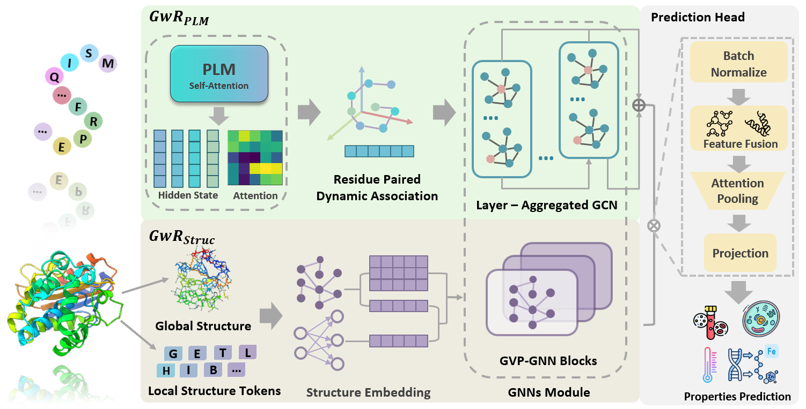
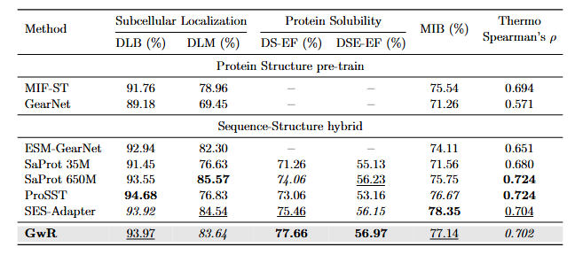

# Graph with Residue-Based Cross-Modal Framework: Sequence-Structure Hybrid Modeling

## 🚀 Introduction

Fine-tuning Protein Language Models (PLMs) either by relying solely on sequence information or by incorporating structure-aware features within language modeling methods has not led to substantial improvements in protein properties predictive performance. we propose a novel **G**raph **w**ith **R**esidues (**GwR**)-based cross-modal framework. GwR employs a Layer-Aggregated Graph Convolutional Network (LA-GCN) and a Geometric Vector Perceptron-Graph Neural Network (GVP-GNN) to perform representation learning on two complementary residue graphs: one is based on PLMs and self-attention mechanisms to capture semantic features and dynamic residue associations from sequences, and the other incorporates structure-aware sequences and spatial topology to describe structural characteristics of proteins.



## 📑 Results

### News

[2025.05.20] Our paper has been submitted to **[JCIM](https://pubs.acs.org/journal/jcisd8)**, and the first round of revisions has been completed.

### Paper Results

- The GwR framework consistently boosts the performance of seven PLMs across subcellular localization and solubility prediction tasks. Notably, models with weaker sequence representations benefit the most from GwR’s structure-aware enhancements.

- GwR outperforms other fine-tuning and deep learning methods, ranking top-3 in all tasks and achieving the best results in solubility prediction.

- GwR accelerates convergence by reducing training loss faster and reaching optimal performance with fewer epochs, improving training efficiency by up to 40.6% on validation sets and over 2× on training sets.

- GwR is robust to structural variation, maintaining performance across different structure sources (AlphaFold2 vs. ESMFold), structural encodings (DSSP vs. Foldseek), and even under structural noise, demonstrating strong adaptability and generalization.



## 🛫 Requirement

### Conda Enviroment

Please make sure you have installed **[Anaconda3](https://www.anaconda.com/download)** or **[Miniconda3](https://docs.conda.io/projects/miniconda/en/latest/)**.

Then
```
cd GwR
```
You can create the required environment using the following two methods.
```
conda env create -f environment.yaml
conda activate gwr
```
or
```
conda create -n gwr python=3.8.18
conda activate gwr
pip install -r requirements.txt
```

### Hardware

All protein folding, data processing and experiments were conducted on 8 NVIDIA RTX 4090 GPUs. If you intend to utilize a larger pre-trained PLM within GwR, additional hardware resources may be necessary.

## 🧬 Start with CPE-Pro

### Dataset Information

| Dataset                         | Protein | Seq. len. | Train/Valid/Test   | Task Type     | PDB                                                                           |
|---------------------------------|---------|-----------|---------------------|---------------|-------------------------------------------------------------------------------|
| **[DeepLoc-Binary](https://huggingface.co/datasets/AI4Protein/DeepLocBinary_AlphaFold2)**       | 8,472   | 481.4     | 5,735/1,009/1,728   | Binary Cls    | **[AF2; EF](https://huggingface.co/datasets/AI4Protein/DeepLocBinary_PDB)**   |
| **[DeepLoc-Multi](https://huggingface.co/datasets/AI4Protein/DeepLocMulti_AlphaFold2)**        | 13,724  | 505.2     | 9,324/1,658/2,742   | Multi (10)-Cls| **[AF2; EF](https://huggingface.co/datasets/AI4Protein/DeepLocMulti_PDB)**    |
| **[DeepSol-ESMFold](https://huggingface.co/datasets/AI4Protein/DeepSol_ESMFold)**    | 71,342 | 298.0     | 62,399/6,942/2,001  | Binary Cls    | **[EF](https://huggingface.co/datasets/AI4Protein/DeepSol_ESMFold_PDB)**      |
| **[DeepSoluE-ESMFold](https://huggingface.co/datasets/AI4Protein/DeepSoluE_ESMFold)** | 14,533 | 363.7  | 10,290/1,143/3,100  | Binary Cls    | **[EF](https://huggingface.co/datasets/AI4Protein/DeepSoluE_ESMFold_PDB)**    |
| **[MetalIonBinding](https://huggingface.co/datasets/AI4Protein/MetalIonBinding_AlphaFold2)**      | 6,395   | 296.1     | 5,068/662/665       | Binary Cls    | **[AF2; EF](https://huggingface.co/datasets/AI4Protein/MetalIonBinding_PDB)** |
| **[Thermostability](https://huggingface.co/datasets/AI4Protein/Thermostability_AlphaFold2)**   | 7,061 | 579.4     | 5,056/669/1,336     | Regression    | **[AF2; EF](https://huggingface.co/datasets/AI4Protein/Thermostability_PDB)** |

### Train

The `script/example/train_GwR.sh` script demonstrates how to train a downstream task-specific GwR.

- Note: The paths of task dataset, protein structure PDB, output log, etc. need to be set according to the actual situation.
